# Hermes Agent Ansible Setup — Install Flow

```mermaid
%%{init: {'theme': 'base', 'themeVariables': { 'fontSize': '14px'}}}%%
flowchart TD
    START(["🚀 Start: ansible.hermes_setup"]) --> OS_CHECK{"Rocky Linux 10?\nalma/rhel/rhelAll-10"}

    OS_CHECK -->|yes| PHASE_10
    OS_CHECK -->|no| FAIL(["❌ Unsupported OS"])

    subgraph PHASE_10["📦 Phase 10: Prepare System"]
        direction TB
        P10A["Install Base Packages\n(bash, curl, git, gh, jq, nodejs, npm, ...)"]
        P10A --> P10B["Install Playwright Runtime Packages\n(fonts, gtk3, atk, cups-libs, ...)"]
        P10B --> P10BT{"Build tools\nenabled?"}
        P10BT -->|yes| P10BU["Install npm Native Build Tools\n(make, gcc, gcc-c++)"]
        P10BU --> P10C
        P10BT -->|no| P10C["Create hermes Group & User\n(no sudo, no wheel, /home/hermes)"]
        P10C --> P10D["Remove hermes from wheel group"]
        P10D --> P10E["Enable linger loginctl\n+ Start user@UID.service"]
        P10E --> P10F["Configure .bashrc\nXDG_RUNTIME_DIR + DBUS"]
    end

    PHASE_10 --> PHASE_20

    subgraph PHASE_20["⚙️ Phase 20: Install & Configure"]
        direction TB
        P20A{"Hermes CLI\nalready installed?"}
        P20A -->|no| P20B["curl | bash upstream installer\n--skip-setup --skip-browser"]
        P20B --> P20C["Create ~/.hermes config dir"]
        P20A -->|yes| P20C
        P20C --> P20D{"Configure\nCodex?"}
        P20D -->|yes| P20E["hermes config set\nmodel.provider + model.default"]
        P20E --> P20F["Strip base_url from config.yaml\n(Codex uses API, not local endpoint)"]
        P20F --> P20G["Print: manual auth required\nhermes auth add openai-codex"]
        P20D -->|no| P20H["Show installed version"]
        P20G --> P20H
        P20H --> P20W{"WebUI\nenabled?"}
        P20W -->|yes| P20X["Clone/update Hermes WebUI\nwrite .env + state/work dirs"]
        P20W -->|no| P20Z(("⏭️"))
        P20X --> P20Z
    end

    PHASE_20 --> P25_ANSIBLE

    subgraph P25_ANSIBLE["🔧 Phase 25: Ansible Runtime (optional)"]
        direction TB
        P25A{"ansible_enable?"}
        P25A -->|yes| P25B["cd ~/ && curl | sh ansible-uv.bitbull.ch\nSCOPE=user → ~/ansible/apps"]
        P25B --> P25C["Add ansible.sh to .bashrc"]
        P25C --> P25D["Show ansible --version"]
        P25A -->|no| P25_SKIP(("⏭️"))
    end

    P25_ANSIBLE --> PHASE_30

    subgraph PHASE_30["🔌 Phase 30: Systemd User Services"]
        direction TB
        P30A{"gateway\nenabled?"}
        P30A -->|yes| P30B["Template → hermes-gateway.service\n~/.config/systemd/user/"]
        P30B --> P30C["systemctl --user daemon-reload"]
        P30C --> P30D["systemctl --user enable"]
        P30D --> P30E["systemctl --user start"]
        P30E --> P30F["systemctl --user is-active ✓"]

        P30G{"dashboard\nenabled?"}
        P30G -->|yes| P30H["Template → hermes-dashboard.service\n~/.config/systemd/user/"]
        P30H --> P30I["systemctl --user daemon-reload"]
        P30I --> P30J["systemctl --user enable"]
        P30J --> P30K["systemctl --user start (loopback)"]
        P30K --> P30L["dashboard HTTP wait\n+ is-active ✓"]

        P30M{"WebUI\nenabled?"}
        P30M -->|yes| P30N["Template → hermes-webui.service\n~/.config/systemd/user/"]
        P30N --> P30O["systemctl --user daemon-reload"]
        P30O --> P30P["systemctl --user enable/start"]
        P30P --> P30Q["/health wait\n+ is-active ✓"]

        P30A -->|no| P30G
        P30L --> P30M
        P30G -->|no| P30M
    end

    PHASE_30 --> PHASE_35

    subgraph PHASE_35["🌐 Phase 35: nginx Reverse Proxy (optional)"]
        direction TB
        P35A{"nginx\nenabled?"}
        P35A -->|no| P35_SKIP(("⏭️"))
        P35A -->|yes| P35B["Validate dashboard nginx settings:\nFQDN, bind address, TLS"]
        P35B --> P35B2["Validate WebUI nginx settings when WebUI enabled:\nseparate FQDN, bind address, TLS"]
        P35B2 --> P35C["Application authentication is configured in dashboard/WebUI"]
        P35C --> P35C2["Validate Let's Encrypt settings when enabled:\nemail, combined mode, TLS"]
        P35C2 --> P35D["dnf install nginx openssl firewalld\npolicycoreutils-python-utils\n+ certbot when Let's Encrypt enabled"]
        P35D --> P35D2["Ensure TLS directory exists"]
        P35D2 --> P35D3["Ensure Let's Encrypt webroot exists:\n/var/lib/letsencrypt/.well-known/acme-challenge"]
        P35D3 --> P35E["Generate dashboard self-signed TLS cert\n+ set key/cert permissions"]
        P35E --> P35E2["Generate WebUI self-signed TLS cert\n+ set key/cert permissions"]
        P35E2 --> P35E3["Check existing Let's Encrypt certificate"]
        P35E3 --> P35F["Remove legacy dashboard htpasswd file"]
        P35F --> P35F2["Remove legacy /etc/nginx/conf.d/hermes.conf"]
        P35F2 --> P35G["Template dashboard nginx config\nself-signed or existing Let's Encrypt cert"]
        P35G --> P35G2["Remove legacy WebUI htpasswd file"]
        P35G2 --> P35G3["Template WebUI nginx config\nself-signed or existing Let's Encrypt cert"]
        P35G3 --> P35H["SELinux: setsebool httpd_can_network_connect 1"]
        P35H --> P35I["nginx -t syntax check"]
        P35I --> P35J["Enable/start nginx"]
        P35J --> P35FW["Enable/start firewalld when managed"]
        P35FW --> P35K["Build effective firewall ports:\n443/tcp + 80/tcp when Let's Encrypt enabled"]
        P35K --> P35K2["Remove legacy http/https firewalld services"]
        P35K2 --> P35K3["Open configured firewalld ports"]
        P35K3 --> P35K4["firewall-cmd --reload"]
        P35K4 --> P35L{"Let's Encrypt\nenabled?"}
        P35L -->|yes| P35M["Install renewal deploy hook directory\n+ reload-nginx.sh"]
        P35M --> P35N["Reload nginx so ACME challenge config is active"]
        P35N --> P35O["certbot certonly --webroot\ncombined dashboard + WebUI certificate"]
        P35O --> P35P["Check certificate after request"]
        P35P --> P35Q["Re-render dashboard nginx config\nwith /etc/letsencrypt/live/<cert>/fullchain.pem"]
        P35Q --> P35R["Re-render WebUI nginx config\nwith /etc/letsencrypt/live/<cert>/fullchain.pem"]
        P35R --> P35S["nginx -t after certificate switch"]
        P35S --> P35T["Enable/start certbot-renew.timer when available"]
        P35L -->|no| P35T
    end

    PHASE_35 --> PHASE_40

    subgraph PHASE_40["🎭 Phase 40: Playwright Browsers"]
        direction TB
        P40A{"playwright\nenabled?"}
        P40A -->|no| P40_SKIP(("⏭️"))
        P40A -->|yes| P40B{"npm: playwright\nin ~/.hermes?"}
        P40B -->|no| P40C["npm install --no-save playwright"]
        P40B -->|yes| P40D(["✅ Already installed"])
        P40C --> P40D
        P40D --> P40E["npx playwright install chromium"]
        P40E --> P40F{"ldd check\nenabled?"}
        P40F -->|yes| P40G["ldd chrome-headless-shell\n→ verify no 'not found' libs"]
        P40F -->|no| P40H{"smoke test\nenabled?"}
        P40G --> P40H
        P40H -->|yes| P40I["node -e 'chromium.launch →\ngoto(headless) → h1 check'"]
        P40I --> P40J["Show: dependency check ✓\n+ smoke test result"]
        P40H -->|no| P40J
    end

    PHASE_40 --> PHASE_50

    subgraph PHASE_50["📋 Phase 50: Next Steps"]
        direction TB
        P50A["Print manual post-install steps:"]
        P50B["1️⃣  sudo -iu hermes hermes auth add openai-codex"]
        P50C["2️⃣  Restart services after config change:\nsystemctl --user restart gateway/dashboard/webui"]
        P50D["3️⃣  Browser UIs: loopback checks\ndashboard :8080, WebUI :8787/health"]
        P50E["4️⃣  Verify nginx: nginx -t && curl -skI\ndashboard/WebUI FQDNs"]
    end

    PHASE_50 --> DONE(["✅ Done — Hermes ready!\nManual Codex OAuth still needed"])

    style START fill:#1a1a2e,stroke:#16213e,color:#e0e0e0
    style DONE fill:#0f3460,stroke:#16213e,color:#e94560
    style FAIL fill:#5a1a1a,stroke:#8b0000,color:#ff6b6b

    style PHASE_10 fill:#1e3a2f,stroke:#2d5a4b,color:#a0d0b0
    style PHASE_20 fill:#1e2a3a,stroke:#2d3f5a,color:#a0b8d0
    style P25_ANSIBLE fill:#2a1e2a,stroke:#4a2d4a,color:#c0a0d0
    style PHASE_30 fill:#3a2e1e,stroke:#5a4b2d,color:#d0c0a0
    style PHASE_35 fill:#3a1e1e,stroke:#5a3d2d,color:#d0a0a0
    style PHASE_40 fill:#1e3a3a,stroke:#2d5a5a,color:#a0d0d0
    style PHASE_50 fill:#2e2e2e,stroke:#4a4a4a,color:#d0d0d0

    style P35_SKIP fill:#333,stroke:#555
    style P40_SKIP fill:#333,stroke:#555
    style P25_SKIP fill:#333,stroke:#555
```

## Architecture Overview

```mermaid
%%{init: {'theme': 'base'}}%%
flowchart LR
    subgraph EXTERNAL["Internet"]
        USER((👤 User\nBrowser))
        HERMES_INST["raw.githubusercontent.com\nNousResearch/hermes-agent\n↓ install.sh"]
        CODEX["api.openai.com\nCodex GPT-5.5"]
    end

    subgraph HOST["Rocky Linux 10 Host"]
        subgraph SYSTEM["System Services (root)"]
            NGINX["nginx\nHTTPS :443\nTLS + reverse proxy\nACME HTTP-01 on :80 when enabled"]
            CERTBOT["certbot\ncombined dashboard/WebUI cert\nrenew timer + nginx deploy hook"]
            FIREWALL["firewalld\n443/tcp open\n80/tcp when Let's Encrypt enabled"]
        end

        subgraph HERMES_USER["Hermes User (no sudo)"]
            GW["hermes-gateway.service\nsystemd --user"]
            DASH["hermes-dashboard.service\nsystemd --user\n127.0.0.1:8080"]
            WEBUI["hermes-webui.service\nsystemd --user\n127.0.0.1:8787"]
            CLI["hermes CLI\n~/.hermes/bin/"]
            ANSIBLE["Ansible runtime\n~/ansible/apps/"]
            PW["Playwright + Chromium\n~/.cache/ms-playwright/"]
        end
    end

    USER -->|"HTTPS :443"| NGINX
    USER -->|"HTTP-01 :80\n/.well-known/acme-challenge/"| NGINX
    CERTBOT -->|"writes/renews cert"| NGINX
    NGINX -->|"dashboard vhost proxy_pass"| DASH
    NGINX -->|"webui vhost proxy_pass"| WEBUI
    DASH <--> GW
    WEBUI --> CLI
    GW <--> CODEX
    CLI -->|"curl install.sh"| HERMES_INST
    CLI <--> CODEX
    PW --> CLI

    style EXTERNAL fill:#1a1a2e,stroke:#333
    style SYSTEM fill:#2d1e1e,stroke:#4a3333,color:#ffaaaa
    style HERMES_USER fill:#1e2a1e,stroke:#334a33,color:#aaffaa
```

## Summary

| # | Phase | Key Actions | Conditional? |
|---|-------|-------------|:---:|
| 10 | **Prepare** | DNF packages, optional npm build tools, create `hermes` user (no wheel), enable linger, .bashrc env | ❌ |
| 20 | **Install & Configure** | Hermes CLI via upstream `install.sh`, `config set` provider/model, optional WebUI checkout/env | ❌ |
| 25 | **Ansible Runtime** | `curl \| sh` → `~/ansible/apps/`, .bashrc integration | ✅ `ansible_enable` |
| 30 | **Systemd Services** | Template → `hermes-gateway.service`, `hermes-dashboard.service`, optional `hermes-webui.service`, enable+start via `--user` | ✅ gateway/dashboard/WebUI toggles |
| 35 | **nginx Proxy** | Bootstrap self-signed TLS, optional combined Let's Encrypt cert, legacy-auth cleanup, dashboard/WebUI nginx configs, SELinux, firewalld | ✅ `hermes_nginx_enabled` |
| 40 | **Playwright** | `npm install playwright`, `npx playwright install chromium`, `ldd` check, smoke test | ✅ `hermes_playwright_enabled` |
| 50 | **Next Steps** | Print manual `hermes auth add openai-codex` instructions | ❌ |
